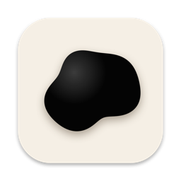

<p align="center"></p>

<h1 align="center">NotchBlob</h1>

A living-ink blob that makes your MacBook's notch look alive. It sits exactly on the notch, starts as the notch's own shape, and when you speak it swells outward about 20% in thick, oily, organic lumps, then settles back when you stop.

Free, no accounts, no API keys, no network. Audio is analysed live on your Mac and never saved or sent anywhere.

## Install (copy and paste into Terminal)

```bash
xcode-select --install 2>/dev/null; git clone https://github.com/freakngenius/NotchBlob.git && cd NotchBlob/notch-app && ./build.sh && open NotchBlob.app
```

If a dialog appears for the Xcode command line tools, finish that install, then run the same line again.

The first launch asks for **Microphone** access. Click Allow. A small waveform icon appears in the menu bar; that's the app's menu.

## Requirements

- A Mac with a notch (MacBook Pro 14"/16" 2021 or later, MacBook Air 2022 or later)
- macOS 13 or newer
- Xcode command line tools (`xcode-select --install`). Full Xcode is not needed.

On a Mac without a notch the blob appears at the top centre of the screen as a notch-sized pill.

## Menu options

Click the waveform icon in the menu bar:

- **How far it grows**: Subtle, Normal, Bold.
- **Only wake when I say "blob"** (off by default): the notch stays still until you say "blob", follows your voice, and goes back to sleep after about 12 seconds of quiet. Uses Apple's speech recognition **on-device only**. If your Mac can't do that, the option refuses to turn on rather than using Apple's servers. The first time, macOS asks for Speech Recognition permission.
- **Wake now**: wakes it by hand for 12 seconds.
- **Use a fake voice (test)**: animates with a synthetic voice, no microphone needed.
- **Quit**.

To start it on login: System Settings > General > Login Items > add `NotchBlob.app`.

## How it works

- A borderless, click-through window sits above the menu bar, exactly over the notch (geometry read from the screen's safe-area insets).
- The microphone feeds a 1024-point FFT. A noise-adaptive voice detector (speech band 250 to 3800 Hz, signal over a learned noise floor, hysteresis) separates your voice from room noise, so typing and fans do not trigger it.
- Voice isolation: besides the loudness gate, the detector checks for a voice's pitch (a repeating pattern between 70 and 400 Hz), so fans, typing and room noise don't move it.
- The outline is a spring-and-diffusion simulation of points around the notch, pushed by six frequency bands with a thick, viscous feel, so it moves in lumpy organic shapes, not a simple pulse.

## Privacy and cost

- Nothing leaves your machine. No analytics, no network code in the app.
- Costs nothing to build or run. No paid services, keys or subscriptions.
- Microphone audio is analysed in memory and discarded.

## Troubleshooting

- **Nothing happens**: make sure Microphone is allowed for Notch Blob in System Settings > Privacy & Security > Microphone. The menu's top line shows the mic state and level.
- **It is asleep**: if you turned on the "blob" wake word, say "blob" or choose "Wake now".
- **Changed the permission after first launch**: quit, then reopen `NotchBlob.app`.
- **Start over on permissions**: `tccutil reset Microphone io.github.notchblob.app` and `tccutil reset SpeechRecognition io.github.notchblob.app`.
- The app is ad-hoc signed and built on your machine, so there is no Gatekeeper "unidentified developer" prompt.
- The icon is drawn by `notch-app/make-icon.swift` (run `swiftc make-icon.swift -o /tmp/mk && mkdir x.iconset && /tmp/mk x.iconset && iconutil -c icns x.iconset -o AppIcon.icns` to regenerate).

## The browser versions (`web/`)

This started as a canvas experiment. Open the files directly in a browser:

- `web/ink-stages.html` shows every stage of the design side by side (served over http for iframes, e.g. `cd web && python3 -m http.server 8765 --bind 127.0.0.1`, then open `http://127.0.0.1:8765/ink-stages.html`).
- `web/ink-ring.html`: the seamless looping liquid ring. Space freezes it, `?seed=7` changes it.
- `web/ink-ring-voice.html`: the voice-driven blob. Add `?wake=1` to skip the wake word, `?demo=1` for a synthetic voice. Say "orange" to wake it (or press O). The keyword listener uses your browser's speech recognition, which in Chrome may send audio to Google's servers. Use `?wake=1` to avoid it.

## License

MIT.
